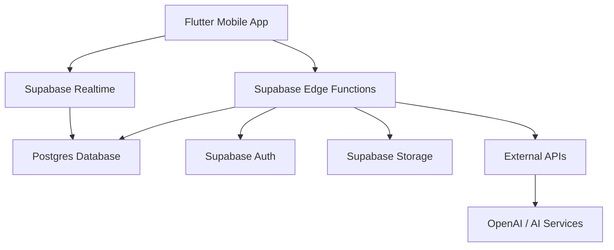
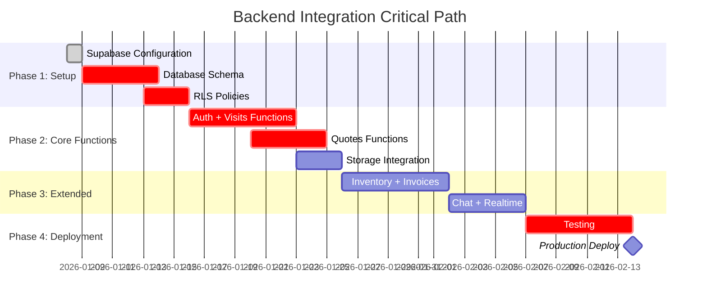

# SmartFlowPro Backend Integration Implementation Plan

**Project**: SmartFlowPro Field Service Management  
**Project Ref**: `pbqbsdmwbjpsvxuuwjiv`  
**Region**: Northeast Asia (Tokyo)  
**Date**: January 8, 2026  
**Version**: 1.0

---

## Table of Contents

1. [Executive Summary](#1-executive-summary)
2. [Current State Assessment](#2-current-state-assessment)
3. [Backend Architecture Overview](#3-backend-architecture-overview)
4. [Phase 1: Supabase Project Setup](#4-phase-1-supabase-project-setup)
5. [Phase 2: Database Schema Implementation](#5-phase-2-database-schema-implementation)
6. [Phase 3: Edge Functions Implementation](#6-phase-3-edge-functions-implementation)
7. [Phase 4: Authentication Integration](#7-phase-4-authentication-integration)
8. [Phase 5: Storage Configuration](#8-phase-5-storage-configuration)
9. [Phase 6: Realtime Integration](#9-phase-6-realtime-integration)
10. [Phase 7: Frontend Integration](#10-phase-7-frontend-integration)
11. [Phase 8: Testing Strategy](#11-phase-8-testing-strategy)
12. [Phase 9: Deployment & Monitoring](#12-phase-9-deployment--monitoring)
13. [Timeline & Milestones](#13-timeline--milestones)
14. [Risk Assessment & Mitigation](#14-risk-assessment--mitigation)
15. [Appendix](#15-appendix)

---

## 1. Executive Summary

### 1.1 Overview
SmartFlowPro is a technician-focused Field Service Management mobile application built with Flutter. The frontend is **complete and production-ready**. This document outlines the comprehensive backend integration strategy using Supabase.

### 1.2 Key Objectives
- ✅ **Maintain** offline-first architecture
- ✅ **Implement** Supabase backend (Postgres, Auth, Edge Functions, Storage, Realtime)
- ✅ **Ensure** zero data loss during sync
- ✅ **Enforce** role-based access control (RBAC) and channel separation
- ✅ **Deploy** production-ready backend infrastructure

### 1.3 Current Status
| Component | Status | Notes |
|-----------|--------|-------|
| Frontend Mobile App | ✅ Complete | Offline-first, conflict resolution, all UI screens |
| Mock Data Layer | ✅ Complete | Comprehensive mock data for all entities |
| Offline Queue | ✅ Complete | Priority-based queue with exponential backoff |
| API Client | ✅ Complete | Dio-based with interceptors and retry logic |
| Supabase Configuration | 🟡 Partial | Config structure ready, credentials needed |
| Database Schema | ❌ Pending | Tables and RLS policies need implementation |
| Edge Functions | ❌ Pending | 30+ functions per PRD requirements |
| Authentication | ❌ Pending | Supabase Auth integration needed |
| Storage Buckets | ❌ Pending | Media, signatures, inventory images |
| Realtime | ❌ Pending | Chat, visits, quotes channels |

---

## 2. Current State Assessment

### 2.1 Frontend Architecture ✅

#### State Management
- **Riverpod**: Primary state management
- **GoRouter**: Navigation with type-safe routes
- **Freezed**: Immutable data models
- **Provider Pattern**: Clean separation of concerns

#### Data Layer Structure
```
lib/shared/data/
├── local/
│   ├── hive_service.dart          ✅ Local caching with Hive
│   ├── offline_queue_service.dart  ✅ Mutation queue (max 1000 operations)
│   └── sync_processor.dart         ✅ Exponential backoff sync
├── remote/
│   ├── api_client.dart             ✅ Dio-based HTTP client
│   └── api_interceptor.dart        ✅ Auth token management
├── repositories/
│   └── base_repository.dart        ✅ Unified fetch/mutate pattern
└── models/
    └── conflict_model.dart         ✅ Optimistic locking support
```

#### Feature Repositories (All Complete)
- ✅ `visit_repository.dart` - Visit CRUD + state transitions
- ✅ `quote_repository.dart` - Quote lifecycle management
- ✅ `invoice_repository.dart` - Invoice creation + payment tracking
- ✅ `inventory_repository.dart` - Inventory management
- ✅ `chat_repository.dart` - Internal chat
- ✅ `auth_repository.dart` - Authentication flows

#### Offline Capabilities ✅
- **Local Cache**: Hive-based with configurable TTL
- **Mutation Queue**: Priority-based (critical → high → normal → low)
- **Conflict Detection**: Version-based optimistic locking
- **Sync Strategy**: API → Cache → Mock (with automatic fallback)
- **Max Queue Size**: 1000 operations (per PRD)
- **Retry Logic**: Exponential backoff with max 3 retries

### 2.2 Backend Structure (Current State)

#### Supabase Project Linked ✅
- **Project ID**: `pbqbsdmwbjpsvxuuwjiv`
- **Project Name**: SmartFlowPro
- **Region**: Northeast Asia (Tokyo)
- **CLI**: Linked via `supabase link`

#### Configuration Files Present
```
lib/core/config/
├── supabase_config.dart      ✅ Environment variable management
├── app_config.dart            ✅ Feature flags and modes
└── api_endpoints.dart         ✅ All endpoint constants defined
```

#### API Endpoint Structure (Ready for Backend)
All endpoints defined in `api_endpoints.dart`:
- `/v1/auth/*` - Authentication endpoints
- `/v1/tech/visits/*` - Visit management (technician)
- `/v1/tech/quotes/*` - Quote lifecycle (technician)
- `/v1/tech/invoices/*` - Invoice management (technician)
- `/v1/tech/inventory/*` - Inventory + AI detection
- `/v1/tech/chat/*` - Internal chat
- `/v1/tech/ai/*` - AI assistant proxy

#### Mock Data Implementation ✅
All features have comprehensive mock data:
- `visit_mock_data.dart` - Visits, customers, properties, jobs
- `quote_mock_data.dart` - Quotes with line items
- `invoice_mock_data.dart` - Invoices with payments
- `inventory_mock_data.dart` - Inventory items
- `chat_mock_data.dart` - Chat threads and messages

---

## 3. Backend Architecture Overview

### 3.1 Chosen Stack (Per PRD Section 2.1)



| Component | Technology | Purpose |
|-----------|-----------|---------|
| **Database** | Supabase Postgres | Multi-tenant data storage with RLS |
| **Auth** | Supabase Auth | JWT-based authentication |
| **Authorization** | Postgres RLS | Row-level security policies |
| **API/Logic** | Supabase Edge Functions (Deno) | Business logic + validation |
| **Realtime** | Supabase Realtime | WebSocket subscriptions |
| **Storage** | Supabase Storage | Media, signatures, documents |
| **AI** | Edge Function Proxy | AI assistant (OpenAI/Claude) |

### 3.2 Architectural Principles

1. **Multi-tenant by default** - Every table has `org_id`
2. **Security-first** - RLS enforces all access rules
3. **Channel-aware** - `web_admin` vs `mobile_technician` separation
4. **Offline-friendly** - Mobile app syncs when online
5. **Event-driven** - Realtime subscriptions for live updates

### 3.3 Backend Responsibilities

✅ Authentication & session management  
✅ Role & channel enforcement  
✅ Visit lifecycle state transitions  
✅ Quote → invoice locking rules  
✅ Inventory source of truth  
✅ Internal chat routing  
✅ Audit logging  
✅ AI request handling & rate limiting  
✅ Payment recording & validation  

---

## 4. Phase 1: Supabase Project Setup

### 4.1 Prerequisites Checklist

- [x] Supabase CLI installed (`v2.58.5`, recommend updating to `v2.67.1`)
- [x] Supabase project created (`pbqbsdmwbjpsvxuuwjiv`)
- [x] Project linked locally via CLI
- [ ] **Action Required**: Get Supabase project credentials
  - [ ] Project URL: `https://pbqbsdmwbjpsvxuuwjiv.supabase.co`
  - [ ] Anon Key (public)
  - [ ] Service Role Key (backend only, never in mobile app)

### 4.2 Environment Configuration

#### Step 1: Get API Keys
```bash
supabase projects api-keys --project-ref pbqbsdmwbjpsvxuuwjiv
```

#### Step 2: Create `.env` File (Backend/Local Development)
```env
# Supabase Configuration
SUPABASE_URL=https://pbqbsdmwbjpsvxuuwjiv.supabase.co
SUPABASE_ANON_KEY=<your-anon-key>
SUPABASE_SERVICE_ROLE_KEY=<your-service-role-key>
ENVIRONMENT=development

# AI Services (for Edge Functions)
OPENAI_API_KEY=<your-openai-key>
OPENAI_MODEL=gpt-4

# Optional: Stripe (Phase 2)
STRIPE_SECRET_KEY=<your-stripe-key>
STRIPE_WEBHOOK_SECRET=<your-webhook-secret>
```

#### Step 3: Update Flutter Environment Variables
For mobile app (never include service role key):
```bash
flutter run \
  --dart-define=SUPABASE_URL=https://pbqbsdmwbjpsvxuuwjiv.supabase.co \
  --dart-define=SUPABASE_ANON_KEY=<your-anon-key> \
  --dart-define=ENVIRONMENT=development
```

#### Step 4: Create `supabase/config.toml`
```toml
project_id = "pbqbsdmwbjpsvxuuwjiv"

[api]
enabled = true
port = 54321
schemas = ["public"]
extra_search_path = ["public"]
max_rows = 1000

[db]
port = 54322
major_version = 15

[studio]
enabled = true
port = 54323

[auth]
enabled = true
site_url = "https://your-frontend-url.com"
additional_redirect_urls = ["exp://localhost:19000"]
jwt_expiry = 3600
enable_signup = false  # Signup via admin invitation only

[storage]
file_size_limit = "100MB"
```

### 4.3 Supabase Dashboard Configuration

1. **Project Settings** → **API**
   - Note down Project URL
   - Copy Anon Key (public)
   - Copy Service Role Key (backend only)

2. **Authentication** → **Providers**
   - Enable Email provider
   - Disable signups (employee invitation only)
   - Set JWT expiry: 1 hour
   - Set refresh token expiry: 7 days

3. **Authentication** → **URL Configuration**
   - Site URL: `https://your-app-domain.com`
   - Redirect URLs: Add mobile app schemes

4. **Database** → **Extensions**
   - Enable `uuid-ossp` (for UUID generation)
   - Enable `pg_stat_statements` (for monitoring)

---

## 5. Phase 2: Database Schema Implementation

### 5.1 Schema Overview (23 Tables per PRD Section 3)

| Table | Purpose | RLS Required |
|-------|---------|--------------|
| `organizations` | Multi-tenant isolation | ✅ |
| `users` | Employee accounts | ✅ |
| `customers` | Customer records | ✅ |
| `properties` | Service locations | ✅ |
| `jobs` | Work orders | ✅ |
| `visits` | Scheduled work | ✅ |
| `notes` | Visit notes | ✅ |
| `inventory_items` | Parts/materials catalog | ✅ |
| `billing_settings` | Org-level pricing | ✅ |
| `quotes` | Draft/finalized quotes | ✅ |
| `line_items` | Quote line items | ✅ |
| `invoices` | Invoices | ✅ |
| `payments` | Payment records | ✅ |
| `chat_threads` | Chat conversations | ✅ |
| `chat_participants` | Chat membership | ✅ |
| `chat_messages` | Messages | ✅ |
| `ai_interaction_logs` | AI usage tracking | ✅ |
| `audit_logs` | Audit trail | ✅ |
| `visit_media` | Photos/videos | ✅ |
| `visit_signatures` | Customer signatures | ✅ |
| `employee_invitations` | Team invitations | ✅ |
| `quote_approvals` | Optional approval tracking | ✅ |
| `sequence_counters` | Auto-increment numbers | ✅ |

### 5.2 Schema Creation Strategy

#### Step 1: Initialize Supabase Migration
```bash
cd /Users/asadkathia/Desktop/smartflowpro
supabase migration new initial_schema
```

#### Step 2: Create Migration File
Location: `supabase/migrations/<timestamp>_initial_schema.sql`

**Migration Structure**:
```sql
-- ============================================
-- SmartFlowPro Database Schema v1.0
-- ============================================

-- Extensions
CREATE EXTENSION IF NOT EXISTS "uuid-ossp";
CREATE EXTENSION IF NOT EXISTS "pg_stat_statements";

-- ============================================
-- 1. Organizations Table
-- ============================================
CREATE TABLE public.organizations (
    id UUID PRIMARY KEY DEFAULT uuid_generate_v4(),
    name TEXT NOT NULL,
    timezone TEXT NOT NULL DEFAULT 'UTC',
    currency TEXT NOT NULL DEFAULT 'USD',
    org_prefix TEXT UNIQUE NOT NULL CHECK (org_prefix ~ '^[A-Z0-9]{1,10}$'),
    plan TEXT,
    settings JSONB DEFAULT '{}'::jsonb,
    updated_at TIMESTAMPTZ DEFAULT now(),
    created_at TIMESTAMPTZ DEFAULT now()
);

-- Index for prefix lookups
CREATE INDEX idx_organizations_prefix ON organizations(org_prefix);

-- ============================================
-- 2. Users Table (Employees)
-- ============================================
CREATE TYPE user_role AS ENUM ('admin', 'dispatcher', 'accountant', 'technician');
CREATE TYPE user_status AS ENUM ('active', 'suspended', 'deactivated');

CREATE TABLE public.users (
    id UUID PRIMARY KEY DEFAULT uuid_generate_v4(),
    org_id UUID NOT NULL REFERENCES organizations(id) ON DELETE CASCADE,
    full_name TEXT NOT NULL,
    email TEXT NOT NULL,
    phone TEXT,
    role user_role NOT NULL,
    status user_status DEFAULT 'active',
    last_login_at TIMESTAMPTZ,
    updated_at TIMESTAMPTZ DEFAULT now(),
    created_at TIMESTAMPTZ DEFAULT now(),
    UNIQUE(org_id, email)
);

CREATE INDEX idx_users_org_id ON users(org_id);
CREATE INDEX idx_users_email ON users(email);
CREATE INDEX idx_users_role ON users(role);

-- ============================================
-- 3. Customers Table
-- ============================================
CREATE TYPE contact_method AS ENUM ('call', 'sms');

CREATE TABLE public.customers (
    id UUID PRIMARY KEY DEFAULT uuid_generate_v4(),
    org_id UUID NOT NULL REFERENCES organizations(id) ON DELETE CASCADE,
    name TEXT NOT NULL,
    phone TEXT NOT NULL,
    email TEXT,
    preferred_contact_method contact_method DEFAULT 'call',
    updated_at TIMESTAMPTZ DEFAULT now(),
    created_at TIMESTAMPTZ DEFAULT now()
);

CREATE INDEX idx_customers_org_id ON customers(org_id);
CREATE INDEX idx_customers_phone ON customers(phone);

-- ============================================
-- 4. Properties Table
-- ============================================
CREATE TABLE public.properties (
    id UUID PRIMARY KEY DEFAULT uuid_generate_v4(),
    org_id UUID NOT NULL REFERENCES organizations(id) ON DELETE CASCADE,
    customer_id UUID NOT NULL REFERENCES customers(id) ON DELETE CASCADE,
    address TEXT NOT NULL,
    latitude DOUBLE PRECISION CHECK (latitude >= -90 AND latitude <= 90),
    longitude DOUBLE PRECISION CHECK (longitude >= -180 AND longitude <= 180),
    updated_at TIMESTAMPTZ DEFAULT now(),
    created_at TIMESTAMPTZ DEFAULT now()
);

CREATE INDEX idx_properties_org_id ON properties(org_id);
CREATE INDEX idx_properties_customer_id ON properties(customer_id);
CREATE INDEX idx_properties_location ON properties USING GIST (ll_to_earth(latitude, longitude));

-- ============================================
-- 5. Jobs Table
-- ============================================
CREATE TYPE job_priority AS ENUM ('low', 'medium', 'high');

CREATE TABLE public.jobs (
    id UUID PRIMARY KEY DEFAULT uuid_generate_v4(),
    org_id UUID NOT NULL REFERENCES organizations(id) ON DELETE CASCADE,
    job_number TEXT UNIQUE NOT NULL,
    customer_id UUID NOT NULL REFERENCES customers(id) ON DELETE RESTRICT,
    service_type TEXT NOT NULL,
    priority job_priority DEFAULT 'medium',
    notes TEXT,
    updated_at TIMESTAMPTZ DEFAULT now(),
    created_at TIMESTAMPTZ DEFAULT now()
);

CREATE INDEX idx_jobs_org_id ON jobs(org_id);
CREATE INDEX idx_jobs_customer_id ON jobs(customer_id);
CREATE INDEX idx_jobs_number ON jobs(job_number);

-- ============================================
-- 6. Visits Table (Primary Operational Entity)
-- ============================================
CREATE TYPE visit_status AS ENUM ('scheduled', 'in_progress', 'paused', 'completed', 'cancelled');

CREATE TABLE public.visits (
    id UUID PRIMARY KEY DEFAULT uuid_generate_v4(),
    org_id UUID NOT NULL REFERENCES organizations(id) ON DELETE CASCADE,
    job_id UUID NOT NULL REFERENCES jobs(id) ON DELETE RESTRICT,
    technician_id UUID REFERENCES users(id) ON DELETE SET NULL,
    scheduled_start TIMESTAMPTZ NOT NULL,
    scheduled_end TIMESTAMPTZ NOT NULL,
    actual_start TIMESTAMPTZ,
    actual_end TIMESTAMPTZ,
    status visit_status DEFAULT 'scheduled',
    status_reason TEXT,
    sequence_order INTEGER,
    version INTEGER DEFAULT 1,
    updated_at TIMESTAMPTZ DEFAULT now(),
    created_at TIMESTAMPTZ DEFAULT now(),
    CHECK (scheduled_end > scheduled_start),
    CHECK (actual_end IS NULL OR actual_start IS NOT NULL)
);

CREATE INDEX idx_visits_org_id ON visits(org_id);
CREATE INDEX idx_visits_technician_id ON visits(technician_id);
CREATE INDEX idx_visits_status ON visits(status);
CREATE INDEX idx_visits_scheduled_range ON visits(scheduled_start, scheduled_end);

-- Continue with remaining 17 tables...
-- (Full schema provided in separate migration files for readability)
```

#### Step 3: RLS (Row Level Security) Policies

**Critical Security Rules** (per PRD Section 4):
1. **Technicians** can only access:
   - Their own assigned visits
   - Org-scoped inventory (read-only + create)
   - Org-scoped chat threads they're participants in
   - Their own AI interaction logs

2. **Admin/Dispatcher** can access:
   - All org data (web_admin channel only)
   - Cannot access mobile_technician endpoints

3. **Channel Enforcement**:
   - `mobile_technician` → blocked from admin operations
   - `web_admin` → blocked from mobile-only features

**Example RLS Policy** (Visits Table):
```sql
-- Enable RLS
ALTER TABLE visits ENABLE ROW LEVEL SECURITY;

-- Policy: Technicians can only read their assigned visits
CREATE POLICY "Technicians can view assigned visits"
ON visits FOR SELECT
TO authenticated
USING (
    org_id IN (
        SELECT org_id FROM users WHERE id = auth.uid()
    )
    AND (
        technician_id = auth.uid()
        OR EXISTS (
            SELECT 1 FROM users
            WHERE id = auth.uid()
            AND role IN ('admin', 'dispatcher')
        )
    )
);

-- Policy: Technicians can update only their assigned visits
CREATE POLICY "Technicians can update assigned visits"
ON visits FOR UPDATE
TO authenticated
USING (
    org_id IN (SELECT org_id FROM users WHERE id = auth.uid())
    AND technician_id = auth.uid()
)
WITH CHECK (
    org_id IN (SELECT org_id FROM users WHERE id = auth.uid())
    AND technician_id = auth.uid()
);

-- Policy: Only admin/dispatcher can create visits (web_admin)
CREATE POLICY "Admin can create visits"
ON visits FOR INSERT
TO authenticated
WITH CHECK (
    org_id IN (SELECT org_id FROM users WHERE id = auth.uid())
    AND EXISTS (
        SELECT 1 FROM users
        WHERE id = auth.uid()
        AND role IN ('admin', 'dispatcher')
    )
);
```

#### Step 4: Database Functions & Triggers

**Auto-update `updated_at` Trigger**:
```sql
CREATE OR REPLACE FUNCTION update_updated_at_column()
RETURNS TRIGGER AS $$
BEGIN
    NEW.updated_at = now();
    RETURN NEW;
END;
$$ LANGUAGE plpgsql;

-- Apply to all tables
CREATE TRIGGER update_organizations_updated_at
BEFORE UPDATE ON organizations
FOR EACH ROW
EXECUTE FUNCTION update_updated_at_column();

-- Repeat for all tables with updated_at
```

**Sequence Counter Function** (for auto-incrementing numbers):
```sql
CREATE OR REPLACE FUNCTION get_next_sequence(
    p_org_id UUID,
    p_entity_type TEXT
)
RETURNS INTEGER AS $$
DECLARE
    v_next_seq INTEGER;
BEGIN
    -- Lock the row for update (prevents race conditions)
    INSERT INTO sequence_counters (org_id, entity_type, current_sequence)
    VALUES (p_org_id, p_entity_type, 0)
    ON CONFLICT (org_id, entity_type)
    DO UPDATE SET current_sequence = sequence_counters.current_sequence
    RETURNING current_sequence + 1 INTO v_next_seq;
    
    -- Update the sequence
    UPDATE sequence_counters
    SET current_sequence = v_next_seq,
        updated_at = now()
    WHERE org_id = p_org_id AND entity_type = p_entity_type;
    
    RETURN v_next_seq;
END;
$$ LANGUAGE plpgsql;
```

**Generate Quote Number Function**:
```sql
CREATE OR REPLACE FUNCTION generate_quote_number(p_org_id UUID)
RETURNS TEXT AS $$
DECLARE
    v_org_prefix TEXT;
    v_sequence INTEGER;
BEGIN
    -- Get org prefix
    SELECT org_prefix INTO v_org_prefix
    FROM organizations WHERE id = p_org_id;
    
    -- Get next sequence
    SELECT get_next_sequence(p_org_id, 'quote') INTO v_sequence;
    
    -- Format: QT-{prefix}-{sequence:04d}
    RETURN 'QT-' || v_org_prefix || '-' || lpad(v_sequence::TEXT, 4, '0');
END;
$$ LANGUAGE plpgsql;
```

#### Step 5: Apply Migration
```bash
# Apply locally (for testing)
supabase db reset

# Push to production
supabase db push
```

### 5.3 Data Validation Rules (Database Level)

Implement constraints per PRD Section 18:

```sql
-- Payment amount validation
ALTER TABLE payments
ADD CONSTRAINT check_payment_amount_positive
CHECK (amount > 0);

-- Tax rate validation
ALTER TABLE billing_settings
ADD CONSTRAINT check_tax_rate_valid
CHECK (tax_rate >= 0 AND tax_rate <= 1);

-- Service call fee validation
ALTER TABLE billing_settings
ADD CONSTRAINT check_service_call_fee_positive
CHECK (service_call_fee >= 0);

-- File size defaults (in org settings JSONB)
-- Enforced in Edge Functions based on org.settings
```

---

## 6. Phase 3: Edge Functions Implementation

### 6.1 Edge Functions Overview (30 Functions per PRD Section 2.4)

#### Core Functions Structure
```
supabase/functions/
├── _shared/
│   ├── auth_guard.ts          # RBAC + channel enforcement
│   ├── db.ts                  # Database client helper
│   ├── storage.ts             # Storage helpers
│   ├── validation.ts          # Input validation
│   └── types.ts               # Shared types
├── auth/
│   ├── login/
│   ├── logout/
│   └── forgot-password/
├── tech/
│   ├── visits/
│   │   ├── today/
│   │   ├── [id]/start/
│   │   ├── [id]/pause/
│   │   └── [id]/complete/
│   ├── quotes/
│   │   ├── create/
│   │   ├── finalize/
│   │   └── create-invoice-draft/
│   ├── inventory/
│   │   ├── items/
│   │   └── ai-detect/
│   └── ai/
│       └── assist/
└── admin/
    ├── team/
    └── customers/
```

### 6.2 Priority 1 Functions (MVP - Week 1-2)

#### 1. `auth_guard` (Shared Middleware)
**Purpose**: Validate JWT + enforce role & channel  
**File**: `supabase/functions/_shared/auth_guard.ts`

```typescript
import { createClient } from '@supabase/supabase-js'

export interface AuthContext {
  userId: string
  orgId: string
  role: 'admin' | 'dispatcher' | 'accountant' | 'technician'
  channel: 'web_admin' | 'mobile_technician'
}

export async function authGuard(
  req: Request,
  allowedRoles: string[],
  allowedChannels: string[]
): Promise<AuthContext> {
  // Extract JWT from Authorization header
  const authHeader = req.headers.get('Authorization')
  if (!authHeader) {
    throw new Error('Missing Authorization header')
  }

  const token = authHeader.replace('Bearer ', '')
  
  // Verify JWT with Supabase
  const supabase = createClient(
    Deno.env.get('SUPABASE_URL')!,
    Deno.env.get('SUPABASE_SERVICE_ROLE_KEY')!
  )
  
  const { data: { user }, error } = await supabase.auth.getUser(token)
  if (error || !user) {
    throw new Error('Invalid token')
  }

  // Get user profile from database
  const { data: profile } = await supabase
    .from('users')
    .select('org_id, role, status')
    .eq('id', user.id)
    .single()

  if (!profile || profile.status !== 'active') {
    throw new Error('User inactive or not found')
  }

  // Check role permission
  if (!allowedRoles.includes(profile.role)) {
    throw new Error('Insufficient permissions')
  }

  // Check channel (from custom claim or header)
  const channel = req.headers.get('X-Channel') || 'mobile_technician'
  if (!allowedChannels.includes(channel)) {
    throw new Error('Invalid channel for this role')
  }

  return {
    userId: user.id,
    orgId: profile.org_id,
    role: profile.role,
    channel: channel as 'web_admin' | 'mobile_technician'
  }
}
```

#### 2. `/v1/tech/visits/today` (Get Today's Visits)
**Purpose**: Fetch technician's visits for today  
**File**: `supabase/functions/tech-visits-today/index.ts`

```typescript
import { serve } from 'https://deno.land/std@0.168.0/http/server.ts'
import { createClient } from '@supabase/supabase-js'
import { authGuard } from '../_shared/auth_guard.ts'

serve(async (req) => {
  try {
    // Authenticate and authorize
    const auth = await authGuard(req, ['technician'], ['mobile_technician'])

    // Initialize Supabase client
    const supabase = createClient(
      Deno.env.get('SUPABASE_URL')!,
      Deno.env.get('SUPABASE_SERVICE_ROLE_KEY')!
    )

    // Get today's date range
    const today = new Date()
    today.setHours(0, 0, 0, 0)
    const tomorrow = new Date(today)
    tomorrow.setDate(tomorrow.getDate() + 1)

    // Fetch visits (RLS automatically filters by technician)
    const { data: visits, error } = await supabase
      .from('visits')
      .select(`
        *,
        job:jobs!inner (
          *,
          customer:customers!inner (*),
          property:properties (*)
        )
      `)
      .eq('technician_id', auth.userId)
      .gte('scheduled_start', today.toISOString())
      .lt('scheduled_start', tomorrow.toISOString())
      .order('scheduled_start', { ascending: true })

    if (error) throw error

    return new Response(
      JSON.stringify({
        data: visits,
        meta: {
          request_id: crypto.randomUUID(),
          ts: new Date().toISOString()
        }
      }),
      {
        status: 200,
        headers: { 'Content-Type': 'application/json' }
      }
    )
  } catch (error) {
    return new Response(
      JSON.stringify({
        error: {
          code: error.message.includes('permissions') ? 'FORBIDDEN' : 'INTERNAL_ERROR',
          message: error.message
        },
        meta: {
          request_id: crypto.randomUUID(),
          ts: new Date().toISOString()
        }
      }),
      {
        status: error.message.includes('permissions') ? 403 : 500,
        headers: { 'Content-Type': 'application/json' }
      }
    )
  }
})
```

#### 3. `/v1/tech/visits/:id/start` (Start Visit)
**Purpose**: Transition visit to `in_progress` status  
**File**: `supabase/functions/tech-visits-start/index.ts`

```typescript
import { serve } from 'https://deno.land/std@0.168.0/http/server.ts'
import { createClient } from '@supabase/supabase-js'
import { authGuard } from '../_shared/auth_guard.ts'

serve(async (req) => {
  try {
    const auth = await authGuard(req, ['technician'], ['mobile_technician'])
    const url = new URL(req.url)
    const visitId = url.pathname.split('/').slice(-2)[0]

    const supabase = createClient(
      Deno.env.get('SUPABASE_URL')!,
      Deno.env.get('SUPABASE_SERVICE_ROLE_KEY')!
    )

    // Get visit and check ownership
    const { data: visit, error: fetchError } = await supabase
      .from('visits')
      .select('*')
      .eq('id', visitId)
      .eq('technician_id', auth.userId)
      .single()

    if (fetchError || !visit) {
      throw new Error('Visit not found or access denied')
    }

    // Validate state transition (scheduled → in_progress)
    if (visit.status !== 'scheduled' && visit.status !== 'paused') {
      throw new Error(`Cannot start visit with status: ${visit.status}`)
    }

    // Update visit status with optimistic locking
    const { data: updated, error: updateError } = await supabase
      .from('visits')
      .update({
        status: 'in_progress',
        actual_start: visit.actual_start || new Date().toISOString(),
        version: visit.version + 1
      })
      .eq('id', visitId)
      .eq('version', visit.version)  // Optimistic lock
      .select()
      .single()

    if (updateError) {
      if (updateError.message.includes('version')) {
        return new Response(
          JSON.stringify({
            error: {
              code: 'CONFLICT',
              message: 'Visit was modified by another user'
            }
          }),
          { status: 409, headers: { 'Content-Type': 'application/json' } }
        )
      }
      throw updateError
    }

    // Log audit entry
    await supabase.from('audit_logs').insert({
      org_id: auth.orgId,
      entity: 'visit',
      entity_id: visitId,
      action: 'start',
      performed_by: auth.userId,
      payload: { previous_status: visit.status, new_status: 'in_progress' }
    })

    return new Response(
      JSON.stringify({
        data: updated,
        meta: { request_id: crypto.randomUUID(), ts: new Date().toISOString() }
      }),
      { status: 200, headers: { 'Content-Type': 'application/json' } }
    )
  } catch (error) {
    return new Response(
      JSON.stringify({
        error: { code: 'ERROR', message: error.message }
      }),
      { status: 500, headers: { 'Content-Type': 'application/json' } }
    )
  }
})
```

#### 4. `/v1/tech/quotes/create` (Create Draft Quote)
**Purpose**: Create quote with auto-added service call fee  
**Validation**: Service call fee locked, tax rules enforced

```typescript
// Key logic:
// 1. Get billing_settings for org
// 2. Create quote with taxable flag
// 3. Auto-add service_call_fee line item (locked)
// 4. Return quote with generated quote_number
```

#### 5. `/v1/tech/quotes/:id/finalize` (Finalize Quote)
**Purpose**: Lock quote and prepare for invoicing  
**Validation**: Must have ≥ 1 line item (service_call_fee counts)

```typescript
// Key logic:
// 1. Validate quote has line items
// 2. Calculate totals (subtotal, tax, discount, grand_total)
// 3. Update status to 'finalized'
// 4. Set locked_at and locked_by
// 5. Increment version for optimistic locking
```

### 6.3 Priority 2 Functions (Week 3-4)

6. `/v1/tech/inventory/items` - List inventory
7. `/v1/tech/inventory/items` (POST) - Create inventory item
8. `/v1/tech/inventory/ai-detect` - AI auto-detection
9. `/v1/tech/quotes/:id/create-invoice-draft` - Create invoice
10. `/v1/tech/invoices/:id/finalize` - Finalize invoice
11. `/v1/tech/chat/threads` - List chat threads
12. `/v1/tech/chat/threads/:id/messages` - Send message
13. `/v1/tech/visits/:id/notes` - Add note
14. `/v1/tech/visits/:id/media/upload-url` - Get signed upload URL
15. `/v1/tech/visits/:id/media/confirm` - Confirm media upload

### 6.4 Priority 3 Functions (Week 5-6)

16-30. Remaining functions (AI assist, admin endpoints, etc.)

### 6.5 Deployment Commands

```bash
# Deploy single function
supabase functions deploy tech-visits-today

# Deploy all functions
supabase functions deploy --all

# Set environment secrets
supabase secrets set OPENAI_API_KEY=<key>
supabase secrets set STRIPE_SECRET_KEY=<key>
```

---

## 7. Phase 4: Authentication Integration

### 7.1 Supabase Auth Setup

#### Step 1: Configure Auth Provider
```bash
# Enable email authentication
supabase auth enable email

# Disable public signups (invitation-only)
supabase dashboard
# Navigate to Authentication → Settings
# Set "Enable Email Signup" to OFF
```

#### Step 2: Create Auth Hooks (Supabase Hooks)
**File**: `supabase/functions/auth-hooks/on-user-created.ts`

```typescript
// Triggered when Supabase Auth creates a user
// Purpose: Link auth user to users table
import { serve } from 'https://deno.land/std@0.168.0/http/server.ts'
import { createClient } from '@supabase/supabase-js'

serve(async (req) => {
  const { type, record } = await req.json()

  if (type !== 'INSERT') return new Response('OK')

  const supabase = createClient(
    Deno.env.get('SUPABASE_URL')!,
    Deno.env.get('SUPABASE_SERVICE_ROLE_KEY')!
  )

  // Check if user was created via invitation
  const { data: invitation } = await supabase
    .from('employee_invitations')
    .select('*')
    .eq('email', record.email)
    .eq('status', 'pending')
    .single()

  if (invitation) {
    // Create user profile
    await supabase.from('users').insert({
      id: record.id,  // Same ID as auth.users
      org_id: invitation.org_id,
      full_name: invitation.full_name,
      email: record.email,
      phone: invitation.phone,
      role: invitation.role,
      status: 'active'
    })

    // Mark invitation as accepted
    await supabase
      .from('employee_invitations')
      .update({ status: 'accepted' })
      .eq('id', invitation.id)
  }

  return new Response('OK')
})
```

### 7.2 Flutter Auth Integration

#### Step 1: Install Supabase Flutter Package
```yaml
# pubspec.yaml
dependencies:
  supabase_flutter: ^2.0.0
```

#### Step 2: Initialize Supabase in `main.dart`
```dart
import 'package:supabase_flutter/supabase_flutter.dart';

void main() async {
  WidgetsFlutterBinding.ensureInitialized();
  
  // Initialize Supabase
  await Supabase.initialize(
    url: SupabaseConfig.supabaseUrl,
    anonKey: SupabaseConfig.supabaseAnonKey,
  );
  
  // Initialize Hive for offline storage
  await Hive.initFlutter();
  
  runApp(const ProviderScope(child: MainApp()));
}
```

#### Step 3: Update `auth_repository.dart`
```dart
import 'package:supabase_flutter/supabase_flutter.dart';

class AuthRepository extends BaseRepository {
  final SupabaseClient _supabase = Supabase.instance.client;

  /// Login with email and password
  Future<UserModel> login({
    required String email,
    required String password,
  }) async {
    try {
      // Authenticate with Supabase
      final response = await _supabase.auth.signInWithPassword(
        email: email,
        password: password,
      );

      if (response.session == null) {
        throw AuthException(message: 'Login failed');
      }

      // Fetch user profile
      final profile = await _supabase
          .from('users')
          .select()
          .eq('id', response.user!.id)
          .single();

      // Store session token
      await _authStorage.saveToken(response.session!.accessToken);

      return UserModel.fromJson(profile);
    } catch (e) {
      throw ErrorHandler.handle(e);
    }
  }

  /// Logout
  Future<void> logout() async {
    await _supabase.auth.signOut();
    await _authStorage.clearToken();
  }

  /// Get current session
  Future<Session?> getSession() async {
    return _supabase.auth.currentSession;
  }
}
```

### 7.3 Token Refresh Strategy

```dart
// lib/shared/data/remote/api_interceptor.dart
class ApiInterceptor extends Interceptor {
  @override
  Future<void> onRequest(
    RequestOptions options,
    RequestInterceptorHandler handler,
  ) async {
    // Get current Supabase session
    final session = Supabase.instance.client.auth.currentSession;
    
    if (session != null) {
      // Add access token to headers
      options.headers['Authorization'] = 'Bearer ${session.accessToken}';
    }
    
    handler.next(options);
  }

  @override
  Future<void> onError(
    DioException err,
    ErrorInterceptorHandler handler,
  ) async {
    if (err.response?.statusCode == 401) {
      // Token expired, try to refresh
      final refreshed = await Supabase.instance.client.auth.refreshSession();
      
      if (refreshed.session != null) {
        // Retry request with new token
        final options = err.requestOptions;
        options.headers['Authorization'] = 'Bearer ${refreshed.session!.accessToken}';
        
        try {
          final response = await _dio.fetch(options);
          return handler.resolve(response);
        } catch (e) {
          return handler.reject(err);
        }
      }
    }
    
    handler.next(err);
  }
}
```

---

## 8. Phase 5: Storage Configuration

### 8.1 Storage Buckets Structure

#### Step 1: Create Buckets via CLI
```bash
# Create buckets
supabase storage create visits
supabase storage create inventory
supabase storage create signatures
```

#### Step 2: Configure Bucket Policies
```sql
-- visits bucket: Technicians can upload to their own org folder
CREATE POLICY "Technicians can upload visit media"
ON storage.objects FOR INSERT
TO authenticated
WITH CHECK (
    bucket_id = 'visits'
    AND (storage.foldername(name))[1] IN (
        SELECT org_id::text FROM users WHERE id = auth.uid()
    )
);

CREATE POLICY "Technicians can read visit media"
ON storage.objects FOR SELECT
TO authenticated
USING (
    bucket_id = 'visits'
    AND (storage.foldername(name))[1] IN (
        SELECT org_id::text FROM users WHERE id = auth.uid()
    )
);

-- Similar policies for inventory and signatures buckets
```

### 8.2 File Upload Flow (Signed URLs)

#### Edge Function: `/v1/tech/visits/:id/media/upload-url`
```typescript
// Generate signed upload URL for media
serve(async (req) => {
  const auth = await authGuard(req, ['technician'], ['mobile_technician'])
  const visitId = url.pathname.split('/').slice(-3)[0]
  
  const supabase = createClient(...)
  
  // Verify visit ownership
  const { data: visit } = await supabase
    .from('visits')
    .select('id, org_id')
    .eq('id', visitId)
    .eq('technician_id', auth.userId)
    .single()
  
  if (!visit) throw new Error('Visit not found')
  
  // Generate unique filename
  const fileExt = req.headers.get('X-File-Extension') || 'jpg'
  const fileName = `${crypto.randomUUID()}.${fileExt}`
  const filePath = `${visit.org_id}/visits/${visitId}/${fileName}`
  
  // Generate signed upload URL (valid for 1 hour)
  const { data, error } = await supabase.storage
    .from('visits')
    .createSignedUploadUrl(filePath, {
      upsert: false,
      expiresIn: 3600
    })
  
  if (error) throw error
  
  return new Response(
    JSON.stringify({
      data: {
        upload_url: data.signedUrl,
        file_path: filePath,
        expires_at: new Date(Date.now() + 3600 * 1000).toISOString()
      }
    }),
    { status: 200, headers: { 'Content-Type': 'application/json' } }
  )
})
```

#### Flutter Media Upload Service
```dart
// lib/core/services/media_upload_service.dart
class MediaUploadService {
  /// Upload media to Supabase Storage
  Future<String> uploadVisitMedia({
    required String visitId,
    required File file,
    required String fileType,
  }) async {
    // Step 1: Get signed upload URL
    final response = await apiClient.post(
      ApiEndpoints.buildRouterPath(
        ApiEndpoints.uploadMedia(visitId),
      ),
      options: Options(headers: {
        'X-File-Extension': fileType,
      }),
    );
    
    final uploadUrl = response.data['data']['upload_url'];
    final filePath = response.data['data']['file_path'];
    
    // Step 2: Upload file to signed URL
    final bytes = await file.readAsBytes();
    await Dio().put(
      uploadUrl,
      data: Stream.fromIterable(bytes.map((e) => [e])),
      options: Options(
        contentType: 'image/$fileType',
        headers: {'Content-Length': bytes.length},
      ),
    );
    
    // Step 3: Confirm upload
    await apiClient.post(
      ApiEndpoints.buildRouterPath(
        '${ApiEndpoints.visitMedia(visitId)}/confirm',
      ),
      data: {'file_path': filePath, 'file_type': fileType},
    );
    
    return filePath;
  }
}
```

### 8.3 File Size Validation (per PRD Section 21)

```typescript
// _shared/validation.ts
export const FILE_SIZE_LIMITS = {
  image: 10 * 1024 * 1024,   // 10MB
  pdf: 25 * 1024 * 1024,     // 25MB
  video: 100 * 1024 * 1024,  // 100MB
  signature: 5 * 1024 * 1024  // 5MB
}

export function validateFileSize(
  fileType: 'image' | 'pdf' | 'video' | 'signature',
  fileSize: number,
  orgSettings?: any
): void {
  const limit = orgSettings?.file_size_limits?.[fileType] || FILE_SIZE_LIMITS[fileType]
  if (fileSize > limit) {
    throw new Error(`File size exceeds limit of ${limit / (1024 * 1024)}MB`)
  }
}
```

---

## 9. Phase 6: Realtime Integration

### 9.1 Realtime Channels (per PRD Section 2.5)

| Channel | Purpose | Listeners |
|---------|---------|-----------|
| `visits:{org_id}` | Visit status updates | Technicians, Dispatchers |
| `chat:{chat_id}` | New messages | Chat participants |
| `quotes:{visit_id}` | Quote updates | Technicians, Office staff |

### 9.2 Flutter Realtime Service Implementation

```dart
// lib/core/services/supabase_realtime_service.dart
class SupabaseRealtimeService {
  final SupabaseClient _supabase = Supabase.instance.client;
  final Map<String, RealtimeChannel> _channels = {};

  /// Subscribe to visit updates
  Future<void> subscribeToVisits(String orgId, Function(Map<String, dynamic>) onUpdate) async {
    final channel = _supabase.channel('visits:$orgId')
      .onPostgresChanges(
        event: PostgresChangeEvent.all,
        schema: 'public',
        table: 'visits',
        filter: PostgresChangeFilter(
          type: PostgresChangeFilterType.eq,
          column: 'org_id',
          value: orgId,
        ),
        callback: (payload) {
          onUpdate(payload.newRecord);
        },
      )
      .subscribe();
    
    _channels['visits:$orgId'] = channel;
  }

  /// Subscribe to chat messages
  Future<void> subscribeToChat(String chatId, Function(Map<String, dynamic>) onMessage) async {
    final channel = _supabase.channel('chat:$chatId')
      .onPostgresChanges(
        event: PostgresChangeEvent.insert,
        schema: 'public',
        table: 'chat_messages',
        filter: PostgresChangeFilter(
          type: PostgresChangeFilterType.eq,
          column: 'chat_id',
          value: chatId,
        ),
        callback: (payload) {
          onMessage(payload.newRecord);
        },
      )
      .subscribe();
    
    _channels['chat:$chatId'] = channel;
  }

  /// Unsubscribe from channel
  Future<void> unsubscribe(String channelName) async {
    final channel = _channels[channelName];
    if (channel != null) {
      await channel.unsubscribe();
      _channels.remove(channelName);
    }
  }

  /// Unsubscribe from all channels
  Future<void> unsubscribeAll() async {
    for (final channel in _channels.values) {
      await channel.unsubscribe();
    }
    _channels.clear();
  }
}
```

### 9.3 Riverpod Integration for Realtime Updates

```dart
// lib/features/visits/presentation/providers/visits_realtime_provider.dart
final visitsRealtimeProvider = StreamProvider.autoDispose<List<VisitModel>>((ref) async* {
  final realtimeService = ref.watch(supabaseRealtimeServiceProvider);
  final currentUser = ref.watch(currentUserProvider);
  
  if (currentUser == null) return;
  
  // Initialize with cached visits
  final repository = ref.watch(visitRepositoryProvider);
  final initialVisits = await repository.getTodayVisits();
  yield initialVisits;
  
  // Subscribe to realtime updates
  final controller = StreamController<List<VisitModel>>();
  
  await realtimeService.subscribeToVisits(
    currentUser.orgId,
    (update) async {
      // Refresh visits from repository (will fetch from API/cache)
      final updated = await repository.getTodayVisits();
      controller.add(updated);
    },
  );
  
  ref.onDispose(() {
    realtimeService.unsubscribe('visits:${currentUser.orgId}');
    controller.close();
  });
  
  yield* controller.stream;
});
```

---

## 10. Phase 7: Frontend Integration

### 10.1 Integration Checklist

#### Step 1: Update Configuration
- [x] Link Supabase project
- [ ] Add Supabase URL to `SupabaseConfig`
- [ ] Add Supabase Anon Key to `SupabaseConfig`
- [ ] Set `AppConfig.useMockData = false`

#### Step 2: Install Dependencies
```bash
flutter pub add supabase_flutter
flutter pub get
```

#### Step 3: Update Repositories (Switch from Mock to API)
```dart
// Example: lib/features/visits/data/repositories/visit_repository.dart
class VisitRepository extends BaseRepository {
  // Constructor already receives ApiClient, no changes needed
  VisitRepository(super.apiClient, super.cache, super.offlineQueue);

  Future<List<VisitModel>> getTodayVisits() async {
    return fetchList<VisitModel>(
      cacheKey: CacheKeys.todayVisits,
      apiCall: () async {
        final endpoint = ApiEndpoints.buildRouterPath(ApiEndpoints.todayVisits);
        final response = await apiClient.get('${ApiEndpoints.apiBase}$endpoint');
        return (response.data['data'] as List)
            .map((json) => VisitModel.fromJson(json))
            .toList();
      },
      fromJson: (json) => VisitModel.fromJson(json),
      mockData: () => VisitMockData.getTodayVisits(), // Fallback for dev mode
    );
  }
}
```

#### Step 4: Test API Connectivity
```bash
# Run app with real backend
flutter run \
  --dart-define=SUPABASE_URL=https://pbqbsdmwbjpsvxuuwjiv.supabase.co \
  --dart-define=SUPABASE_ANON_KEY=<anon-key> \
  --dart-define=ENVIRONMENT=development
```

### 10.2 Migration from Mock to Real Backend

#### Switch Mode in `app_config.dart`
```dart
class AppConfig {
  // Set to false when backend is ready
  static bool get useMockData => false;  // Changed from: const bool fromEnvironment('USE_MOCK_DATA', defaultValue: true);
  
  static bool get shouldUseMockData {
    // Only use mock data if:
    // 1. Explicitly enabled via flag
    // 2. OR in development mode AND Supabase not configured
    return useMockData ||
        (isDevelopment && !SupabaseConfig.isValid);
  }
}
```

### 10.3 Offline Sync Testing

#### Test Scenarios
1. **Offline Create**:
   - Disconnect network
   - Create quote
   - Verify queued in offline storage
   - Reconnect network
   - Verify auto-sync

2. **Conflict Resolution**:
   - User A updates visit status
   - User B (offline) updates same visit
   - User B reconnects
   - Verify conflict banner shows
   - Verify server state displayed

3. **Large Queue Sync**:
   - Queue 100+ actions offline
   - Reconnect
   - Verify priority-based processing
   - Verify exponential backoff on failures

---

## 11. Phase 8: Testing Strategy

### 11.1 Database Testing

#### Unit Tests (SQL)
```bash
# Create test file
cd supabase/tests
touch database.test.sql

# Test RLS policies
SELECT plan(10);

-- Test: Technician can only see assigned visits
SELECT results_eq(
  $$ SELECT COUNT(*) FROM visits WHERE technician_id != auth.uid() $$,
  ARRAY[0]::bigint[],
  'Technician should not see unassigned visits'
);

-- Run tests
supabase test db
```

### 11.2 Edge Functions Testing

```typescript
// supabase/functions/tech-visits-today/test.ts
import { assertEquals } from 'https://deno.land/std@0.168.0/testing/asserts.ts'

Deno.test('GET /tech/visits/today - returns today visits', async () => {
  const response = await fetch('http://localhost:54321/functions/v1/tech/visits/today', {
    headers: {
      'Authorization': 'Bearer <test-token>',
      'X-Channel': 'mobile_technician'
    }
  })
  
  assertEquals(response.status, 200)
  const data = await response.json()
  assertEquals(Array.isArray(data.data), true)
})
```

### 11.3 Flutter Integration Tests

```dart
// integration_test/api_integration_test.dart
void main() {
  IntegrationTestWidgetsFlutterBinding.ensureInitialized();

  group('Visit API Integration', () {
    testWidgets('Fetch today visits', (tester) async {
      await tester.pumpWidget(const ProviderScope(child: MainApp()));
      
      // Wait for home screen
      await tester.pumpAndSettle();
      
      // Verify visits loaded
      expect(find.text('Today\'s Visits'), findsOneWidget);
      expect(find.byType(VisitCard), findsAtLeastNWidgets(1));
    });

    testWidgets('Start visit updates status', (tester) async {
      await tester.pumpWidget(const ProviderScope(child: MainApp()));
      await tester.pumpAndSettle();
      
      // Tap first visit
      await tester.tap(find.byType(VisitCard).first);
      await tester.pumpAndSettle();
      
      // Tap Start button
      await tester.tap(find.text('Start Visit'));
      await tester.pumpAndSettle();
      
      // Verify status changed
      expect(find.text('In Progress'), findsOneWidget);
    });
  });
}
```

### 11.4 Load Testing

#### Artillery Configuration
```yaml
# load-tests/config.yml
config:
  target: 'https://pbqbsdmwbjpsvxuuwjiv.supabase.co/functions/v1'
  phases:
    - duration: 60
      arrivalRate: 10
      name: "Warm up"
    - duration: 120
      arrivalRate: 50
      name: "Sustained load"
scenarios:
  - name: "Fetch today visits"
    flow:
      - get:
          url: "/tech/visits/today"
          headers:
            Authorization: "Bearer {{ $processEnvironment.TEST_TOKEN }}"
            X-Channel: "mobile_technician"
```

Run load tests:
```bash
artillery run load-tests/config.yml
```

---

## 12. Phase 9: Deployment & Monitoring

### 12.1 Production Deployment Checklist

#### Pre-Deployment
- [ ] All migrations applied
- [ ] All Edge Functions deployed
- [ ] RLS policies tested
- [ ] Storage buckets configured
- [ ] Environment secrets set
- [ ] Rate limits configured
- [ ] Monitoring dashboards created

#### Deployment Steps
```bash
# 1. Apply production migrations
supabase db push --project-ref pbqbsdmwbjpsvxuuwjiv

# 2. Deploy Edge Functions
supabase functions deploy --all --project-ref pbqbsdmwbjpsvxuuwjiv

# 3. Set production secrets
supabase secrets set --project-ref pbqbsdmwbjpsvxuuwjiv \
  OPENAI_API_KEY=<prod-key> \
  STRIPE_SECRET_KEY=<prod-key>

# 4. Enable Realtime
supabase realtime enable --project-ref pbqbsdmwbjpsvxuuwjiv

# 5. Configure backup schedule (daily at 2 AM UTC)
supabase db backup schedule --project-ref pbqbsdmwbjpsvxuuwjiv --cron "0 2 * * *"
```

### 12.2 Monitoring Setup

#### Supabase Dashboard Monitoring
- **Database**: Monitor query performance, active connections
- **Edge Functions**: Monitor invocations, errors, duration
- **Storage**: Monitor usage, bandwidth
- **Auth**: Monitor active users, failed login attempts

#### External Monitoring (Recommended)

**Sentry Integration** (Error Tracking):
```dart
// lib/main.dart
import 'package:sentry_flutter/sentry_flutter.dart';

Future<void> main() async {
  await SentryFlutter.init(
    (options) {
      options.dsn = 'https://your-sentry-dsn@sentry.io/project-id';
      options.environment = SupabaseConfig.environment;
    },
    appRunner: () => runApp(const ProviderScope(child: MainApp())),
  );
}
```

**LogRocket Integration** (Session Replay):
```typescript
// Edge Functions: _shared/logging.ts
import LogRocket from 'logrocket'

LogRocket.init('your-app-id')

export function logError(error: Error, context: any) {
  LogRocket.captureException(error, { extra: context })
}
```

### 12.3 Performance Metrics (Targets per PRD Section 25)

| Metric | Target | Monitoring |
|--------|--------|-----------|
| API Response Time (p95) | < 200ms | Supabase Dashboard |
| Realtime Latency | < 2s | Custom metrics |
| Offline Sync Time (100 items) | < 30s | App telemetry |
| Database Queries (p95) | < 100ms | pg_stat_statements |

### 12.4 Backup & Disaster Recovery

#### Automated Backups
- **Daily backups**: 2 AM UTC (configured via Supabase)
- **Retention**: 30 days for daily, 1 year for weekly
- **Point-in-Time Recovery (PITR)**: Enabled for production

#### Recovery Procedures
```bash
# Restore from backup
supabase db restore --project-ref pbqbsdmwbjpsvxuuwjiv --backup-id <backup-id>

# Point-in-time recovery
supabase db pitr restore --project-ref pbqbsdmwbjpsvxuuwjiv --time "2026-01-08 14:30:00+00"
```

---

## 13. Timeline & Milestones

### 13.1 Development Timeline (8-10 Weeks)

#### Week 1-2: Foundation
- [x] Supabase project setup
- [ ] Database schema creation (all 23 tables)
- [ ] RLS policies implementation
- [ ] Basic auth integration

**Deliverable**: Database ready, auth working

#### Week 3-4: Core Edge Functions
- [ ] Priority 1 functions (5 functions)
  - auth_guard
  - visits/today
  - visits/:id/start
  - quotes/create
  - quotes/finalize
- [ ] Storage buckets + signed URLs
- [ ] Media upload flow

**Deliverable**: Core visit + quote flows working

#### Week 5-6: Extended Features
- [ ] Priority 2 functions (10 functions)
  - Inventory management
  - Invoice creation
  - Chat functionality
  - Notes + media
- [ ] Realtime subscriptions

**Deliverable**: Full technician workflow functional

#### Week 7-8: Admin Functions + Testing
- [ ] Priority 3 functions (15 functions)
  - Admin endpoints
  - AI assistant proxy
  - Payment recording
  - Team management
- [ ] Comprehensive testing (unit + integration)
- [ ] Load testing

**Deliverable**: Complete backend, tested and documented

#### Week 9-10: Production Deployment
- [ ] Production database migration
- [ ] Edge Functions deployment
- [ ] Monitoring setup
- [ ] User acceptance testing (UAT)
- [ ] Go-live

**Deliverable**: Production-ready system

### 13.2 Critical Path



---

## 14. Risk Assessment & Mitigation

### 14.1 High-Risk Areas

| Risk | Impact | Probability | Mitigation |
|------|--------|-------------|-----------|
| **Data Migration Issues** | High | Medium | • Test migrations on staging<br>• Maintain rollback scripts<br>• Dry-run with production data copy |
| **RLS Policy Gaps** | Critical | Medium | • Comprehensive policy testing<br>• Security audit before go-live<br>• Principle of least privilege |
| **Offline Sync Conflicts** | Medium | High | • Already implemented optimistic locking<br>• Clear conflict UI<br>• User testing of conflict flows |
| **Edge Function Cold Starts** | Medium | Medium | • Keep functions warm (cron pings)<br>• Optimize function size<br>• Cache expensive operations |
| **Realtime Connection Drops** | Low | Medium | • Auto-reconnect logic<br>• Offline banner<br>• Exponential backoff |

### 14.2 Rollback Strategy

#### Database Rollback
```bash
# Revert migration
supabase migration revert --project-ref pbqbsdmwbjpsvxuuwjiv

# Restore from backup
supabase db restore --backup-id <previous-backup>
```

#### Edge Function Rollback
```bash
# Deploy previous version
git checkout <previous-commit>
supabase functions deploy --all
```

#### Feature Flags
```dart
// lib/core/config/app_config.dart
class FeatureFlags {
  static bool get useSupabaseBackend => 
    const bool.fromEnvironment('USE_SUPABASE', defaultValue: false);
  
  static bool get enableRealtime =>
    const bool.fromEnvironment('ENABLE_REALTIME', defaultValue: false);
}
```

---

## 15. Appendix

### 15.1 Supabase CLI Commands Reference

```bash
# Project Management
supabase projects list
supabase link --project-ref <ref>
supabase status

# Database
supabase db pull                    # Pull remote schema
supabase db push                    # Push migrations
supabase db reset                   # Reset local DB
supabase migration new <name>       # Create migration
supabase migration up               # Apply migrations

# Edge Functions
supabase functions new <name>       # Create function
supabase functions deploy <name>    # Deploy function
supabase functions serve            # Local development
supabase secrets set KEY=value      # Set secrets

# Storage
supabase storage create <bucket>    # Create bucket
supabase storage ls <bucket>        # List files

# Testing
supabase test db                    # Run DB tests
supabase test functions <name>      # Test function

# Logs
supabase functions logs <name>      # View function logs
```

### 15.2 Key Documentation Links

- **Supabase Docs**: https://supabase.com/docs
- **Edge Functions Guide**: https://supabase.com/docs/guides/functions
- **RLS Policies**: https://supabase.com/docs/guides/auth/row-level-security
- **Flutter Integration**: https://supabase.com/docs/reference/dart
- **Realtime**: https://supabase.com/docs/guides/realtime

### 15.3 Environment Variables Checklist

#### Backend (Edge Functions)
```env
SUPABASE_URL=https://pbqbsdmwbjpsvxuuwjiv.supabase.co
SUPABASE_SERVICE_ROLE_KEY=<service-role-key>
OPENAI_API_KEY=<openai-key>
OPENAI_MODEL=gpt-4
STRIPE_SECRET_KEY=<stripe-key>  # Phase 2
```

#### Frontend (Flutter)
```env
SUPABASE_URL=https://pbqbsdmwbjpsvxuuwjiv.supabase.co
SUPABASE_ANON_KEY=<anon-key>
ENVIRONMENT=production
```

### 15.4 Contact & Support

| Role | Contact | Responsibility |
|------|---------|---------------|
| Backend Lead | TBD | Edge Functions, Database |
| Frontend Lead | TBD | Flutter app integration |
| DevOps | TBD | Deployment, Monitoring |
| QA Lead | TBD | Testing, UAT |

---

## Next Steps

1. **Immediate Actions** (This Week):
   - [ ] Retrieve Supabase API keys from dashboard
   - [ ] Create `.env` file with credentials
   - [ ] Run first database migration
   - [ ] Deploy first Edge Function (auth_guard)
   - [ ] Test auth flow end-to-end

2. **Week 1 Goals**:
   - [ ] Complete database schema
   - [ ] Implement RLS policies
   - [ ] Deploy core visit functions
   - [ ] Update Flutter app with Supabase SDK

3. **Week 2 Checkpoint**:
   - [ ] Demo working visit flow (fetch, start, complete)
   - [ ] Demo offline queue syncing
   - [ ] Review and adjust timeline if needed

---

**Document Version**: 1.0  
**Last Updated**: January 8, 2026  
**Status**: Ready for Implementation  
**Approval**: Pending